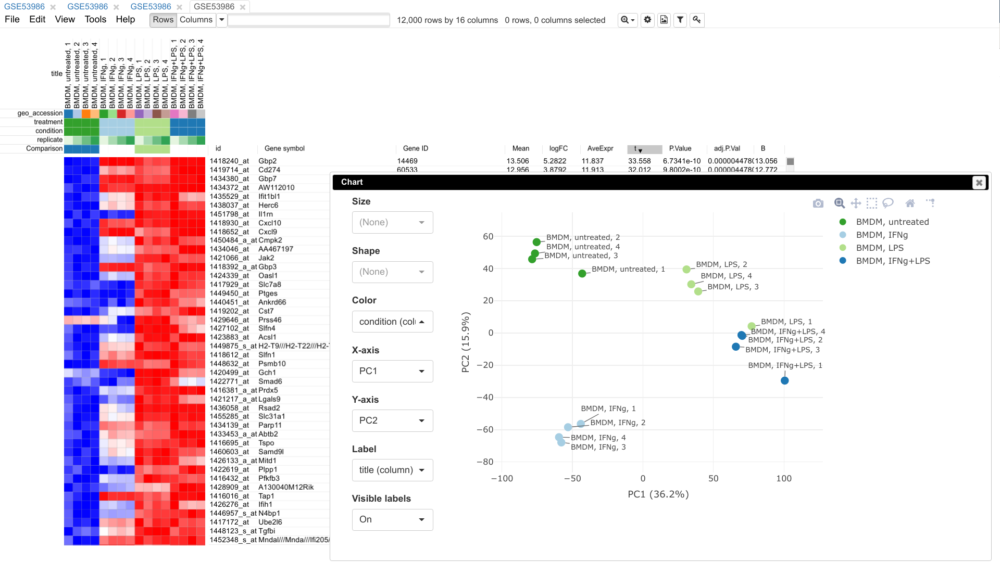

# Phantasus: visual and interactive gene expression analysis

This documentation describes Phantasus -- a web tool designed for visual and
interactive gene expression analysis.
In
particular, it was designed to allow to go from a typical dataset to
differential expression and downstream analysis in an easy and streamlined
manner. For that aim, Phantasus integrates an intuitive heatmap interface with
gene expression analysis tools from Bioconductor. 

Main features:
* Loading public datasets from Gene Expression Omnibus with both microarrays and RNA-seq datasets (via ARCHS4) being supported.
* Differential gene expression using `limma` or `DESeq2`.
* Publication ready plots with export to SVG: PCA plot, row profiles, box plots.
* Clustering: k-means and hierarchical.
* Gene set enrichment analysis via `fgsea` package.
* Sharing session links.

Links:
* Official mirror: <https://alserglab.wustl.edu/phantasus>.
* Source code at GitHub: <https://github.com/ctlab/phantasus>. 
* Bioconductor package: <https://bioconductor.org/packages/phantasus>.
* Docker image: <https://hub.docker.com/r/alserglab/phantasus>.

Citation:
* Kleverov M, Zenkova D, Kamenev V, Sablina R, Artyomov M, Sergushichev A (2024).
    Phantasus, a web application for visual and interactive gene expression analysis.
    Elife, 13, e85722. <https://doi.org/10.7554/eLife.85722>
