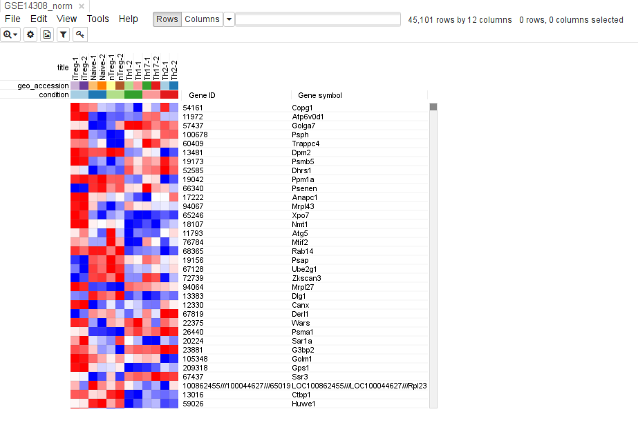

Phantasus can be installed locally, either as an R package or a Docker image.

## Table of contents
{: .no_toc .text-delta }

1. TOC
{:toc }

## Using R

### Installation

Phantasus R package can be installed from Bioconductor:

```r
if (!requireNamespace("BiocManager", quietly = TRUE))
    install.packages("BiocManager")

BiocManager::install("phantasus")
```

Alternatively, the latest version of Phantasus 
can be installed from GitHub using `devtools` package.

```r
devtools::install_github("ctlab/phantasus")
```

A warning could appear that the repository contain submodules. This warning 
can be safely ignored.

### System dependencies

There are several system packages that have to be installed on the system. The
names of these packages will be displayed during installation. On Ubuntu can
install them beforehand and all together using command:

```bash
sudo apt-get install libapparmor-dev libprotobuf-dev protobuf-compiler libcurl4-openssl-dev libssl-dev libxml2-dev
```


### Running


This following `R` command runs the application with the default parameters,
opens it in the default browser (from `browser` option) 
with address <http://0.0.0.0:8000>:

```r
library(phantasus)
servePhantasus()
```

You can customise serving of the application by specifying following parameters:

- `host` and `port` (by default: `"0.0.0.0"` and `8000`);
- `cacheDir` (by default: `tempdir()`) -- directory where downloaded datasets 
    will be saved and reused in later sessions;
- `preloadedDir` (by default: `NULL`) -- directory with `ExpressionSet` 
    objects encoded in rda-files, that can be quickly loaded to application by
    name (see section [Preloaded datasets](#preloaded-datasets));
- `openInBrowser` (by default `TRUE`).

## Using Docker

To simplify deployment phantasus Docker image can be used. It is build regularly and is available at https://hub.docker.com/r/dzenkova/phantasus 
You can run with the following commands:

```bash
docker pull dzenkova/phantasus
docker run -t -d -p 80:80 dzenkova/phantasus
```


Phantasus will be available at <http://localhost>.

Additionally, docker compose can be used (file is available [here](https://github.com/ctlab/phantasus/blob/master/docker-compose.yml)).
You can run with the following command:

```bash
docker-compose up -d
```

Again, Phantasus will be available at <http://localhost>

If you are running Phantasus using docker-compose
you can set up the additional features using commands like this: 

```bash
docker-compose run phantasus R -e 'library(phantasus); updateARCHS4();'
```

## Setting up optional features

Some of Phantasus features require additional set up.

### Preloaded datasets 

Preloaded datasets is a feature that allows quick access to frequently-accessed datasets
or to share them inside the research group.

To store dataset on a server, on nead to save list `ess` of `ExpressionSet` objects
into an RData file with `.rda` extension into a directory as specified in `servePhantasus`.

Let us preprocess and save `GSE14308` dataset:


```r
library(GEOquery)
library(limma)
gse14308 <- getGEO("GSE14308", AnnotGPL = TRUE)[[1]]
gse14308$condition <- sub("-.*$", "", gse14308$title)
pData(gse14308) <- pData(gse14308)[, c("title", "geo_accession", "condition")]
gse14308 <- gse14308[, order(gse14308$condition)]

fData(gse14308) <- fData(gse14308)[, c("Gene ID", "Gene symbol")]
exprs(gse14308) <- normalizeBetweenArrays(log2(exprs(gse14308)+1), method="quantile")

ess <- list(GSE14308_norm=gse14308)

preloadedDir <- tempdir()

save(ess, file=file.path(preloadedDir, "GSE14308_norm.rda"))
```

Next we can serve Phantasus with set `preloadedDir` option:


```r
servePhantasus(preloadedDir=preloadedDir)
```

There you can either put `GSE14308_norm` name when using open option _Saved on server datasets_ or just 
open by specifying the name in URL: http://localhost:8000/?preloaded=GSE14308_norm.



### Support for RNA-seq datasets

Phantasus supports loading RNA-seq datasets from GEO using 
gene expression counts as computed by [ARCHS4 project](http://amp.pharm.mssm.edu/archs4/index.html).
To make it work one need to download gene level expression from 
the [Download](http://amp.pharm.mssm.edu/archs4/download.html) section. The
downloaded files `human_matrix.h5` and `mouse_matrix.h5` should be placed 
into Phantasus cache under archs4 folder.
Or you can call

```r
updateARCHS4(cacheDir=cacheDir)
```


### Pathway database for FGSEA

*FGSEA* requires pathway database in `.rds` files under `<cacheDir>/fgsea` folder.
Pathway database is an `.rds` file containing dataframe with columns: `geneID`, `pathName`, `geneSymbol`. You can see an example dataframe by entering:

```r
data("fgseaExample", package="phantasus")
head(fgseaExample)
```

```
##   geneID                                pathName geneSymbol
## 1  11461 5991955_Cell-cell_junction_organization       Actb
## 2  11465 5991955_Cell-cell_junction_organization      Actg1
## 3  12385 5991955_Cell-cell_junction_organization     Ctnna1
## 4  12388 5991955_Cell-cell_junction_organization     Ctnnd1
## 5  12550 5991955_Cell-cell_junction_organization       Cdh1
## 6  12552 5991955_Cell-cell_junction_organization      Cdh11
```

### Annotation database for AnnotationDB tool

*AnnotationDB* tool requires annotation databases 
under `<cacheDir>/annotationdb` folder. For example you can get 
[Mus Musculus](https://bioconductor.org/packages/release/data/annotation/html/org.Mm.eg.db.html) database package from Bioconductor, extract `org.Mm.eg.sqlite`, and put it to `<cacheDir>/annotationdb` folder.
