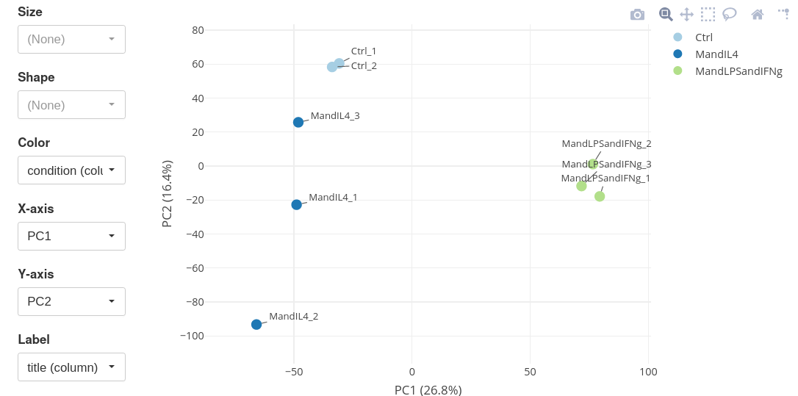

## Table of contents
{: .no_toc .text-delta }

1. TOC
{:toc }

## Introduction

This tutorial describes analysis of RNA-seq dataset [GSE53053](https://www.ncbi.nlm.nih.gov/geo/query/acc.cgi?acc=GSE53053) using limma pipeline.
The dataset measures gene expression in bone marrow derived macrophages treated
either with LPS+IFNg or LPS ([Jha et al., Immunity, 2015](https://doi.org/10.1016/j.immuni.2015.02.005)).

Let's start by opening the dataset in Phantasus by following the link <https://alserglab.wustl.edu/phantasus/?geo=GSE53053>

## Data normalization

We will use `voom` method from `limma` package to transform the gene counts into log-expressions. This essentially produces log2 counts-per-million (CPM) values, but also internally calculates precision weights that can be then used in differential expression analysis.

To do it, open _Tools/Advanced normalization/Voom_ menu. Add _condition_ as a factor into the design matrix. Also, check _Automatically filter our lowly expressed genes_ checkbox to get rid of non-expressed genes.

After we clicking _OK_ a new tab will appear with logCPM values for 15,172 genes.

Now, using _Tool/Plots/PCA Plot_ we can observe the general concordance within the groups, although MandIL4 samples seem to be more noisy.

## Differential expression

We will use _Tools/Differential expression/Limma_ for differential expression analysis. For proper accounting of weights calculated by `voom` in the previous steps, _Advanced design_ tab should be used. As before, add _condition_ factor into the design. Select *MandLPS_andIFNg* as the target level and *Ctrl* as the reference.
Click _OK_ to run the analysis.

The differential expression results will appear as new columns. By clicking on _t_ column two times we can make the most up-regulated genes appear at the top of the heatmap.

## Pathway analysis

For pathway analysis with `fgsea` tool we need to have _Entrez_ gene identifiers.
To get them, let's use _Tools/Annotate/Annotate rows/From database_ menu.
Select _org.Mm.eg.seqlite - Mus musculus_ in the _Speciment DB_ field.
For _Source column_ use _ENSEMBLID_, _Source column type_ is then _ENSEMBL_.
Choose _ENTREZID_ as a _Result column type_.

A new _ENTREZID_ column will appear with the corresponding gene identifiers. 
However, not always there is one-to-one correspondence between _Ensembl_ and _Entrez_ IDs, which results in duplicated _Entrez_ or absent gene IDs. We need to deal with this before running `fgsea`, as it requires unique _Entrez_ entries. 

Let's use _Tools/Collapse_ menu. Select _Maximum Mean Probe_ as the _Collapse method_ and _ENTREZID_ as the collapsing field. Also check _Omit unannotated_ checkbox.

After running the collapse tool, a new tab will appear with around 13,000 unique _Entrez_ genes.

Now we can run _Tools/Pathway analysis/Perform FGSEA_. We will use Gene Ontology biological processes pathway database, `limma`'s moderated t-statistic for gene ranking, and _ENTREZID_ column for gene IDs (in accordance with the pathway database).

Table with FGSEA results will appear in a new tab. 

By clicking, for example, on _Cellular response to interferon-beta_ we will be able to see pathway details. Copy pathway gene IDs and paste them into search field of the heatmap to highlight genes from the pathway. Sort rows by decreasing of _t_ and get a bird's-eye view with _View/Fit To Window_ to get a picture of pathway gene distribution within the dataset.

Finally, and individual GSEA plot for this gene set can be made with 
_Tools/Plots/GSEA plot_. There, select _t_ for ranking and _condition_ for annotation.

