## Table of contents
{: .no_toc .text-delta }

1. TOC
{:toc }

## Introduction

This is the third of three modules on analysis of microarray dataset GSE53986:
1. [Preparing gene expression dataset]()
2. [Exploring dataset]()
3. [Differential expression and downstream analysis]()

In this module we start with a normalized and filtered dataset, do a differential
expression analysis and follow it up with pathway enrichment analysis.

You can either continue the session from the previous module, or download
file [GSE53986_filtered.gct]() 
and load it into Phantasus.

## Apllying _limma_ tool

Differential expression analysis is one of the most straightforward types of analysis
to carry out on gene expression data.
It answers a question what genes a differentially regulated between two conditions
of interest.

After dataset is properly normalized 
[*limma*](https://bioconductor.org/packages/limma) R package can be used 
to do differential expression analysis.
Open _Tool/Diffential Expression/limma_ menu,
Choose _treatment_ as a _Field_, with
_Untreated_ and _LPS_ as classes. 

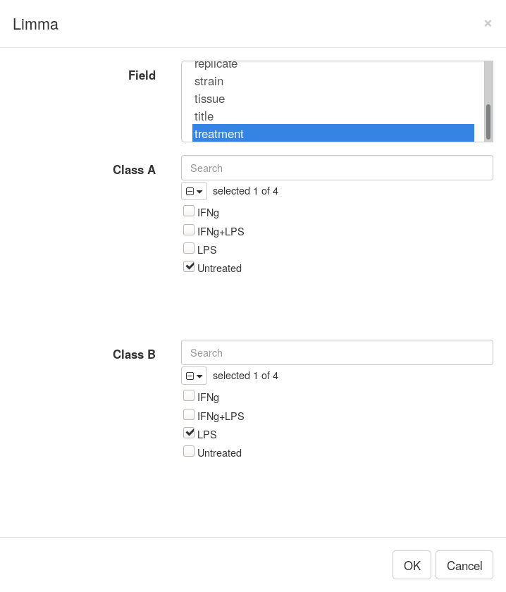

Clicking _OK_ will add columns like *P-value* or *logFC* to the table.
The rows can be ordered by decreasing of *t*-statistic column 
to see which genes are the most up-regulated upon LPS treatment. 

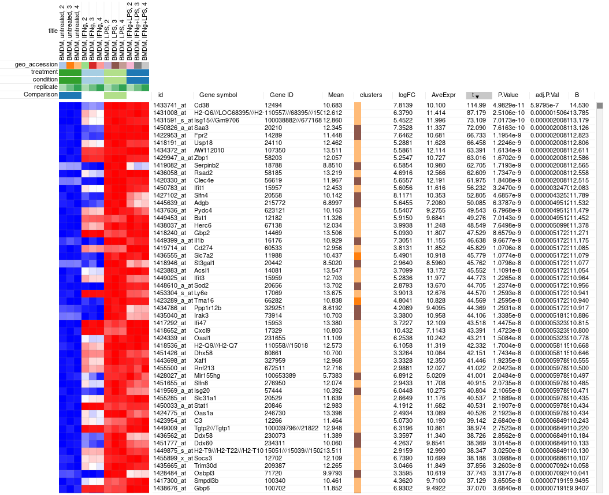

## Saving and sharing the results

We have found genes differentially regulated upon LPS treatment. 
Now we can save the results as a GCT file to able to return to it later
or share with a colleague.
The resulting file should be similar to 
[GSE53986_Ctrl_vs_LPS.gct]().

However, in Phantasus you can share the result by providing link to the current
session. Use *File/Get dataset link* menu.
After you click on it, a window will appear containing a link, that you can share
with other people. Accessing it will load an identical session.

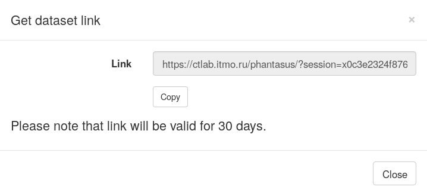

## Pathway enrichment with MSigDB

While we now know what genes are differentially regulated
between our two conditions of interest, these results can be hard to interpret.
There can be too many or too few differential genes, 
a gene can multiple functions and so on.
Naturally, it is much easer to reason about biological processes, or pathways.
A pathway has many genes, which makes its signal to be more robust and it has a 
particular function.

There are many ways to analyze pathways, with over-representation analysis 
being one of the most straightforward. In this analysis we will have a query 
gene set, such as top 250 up-regulated genes, and we will be looking for biological
pathways that have a big intersection with our query. 
For such pathways we can speculate that they are regulated in our process as well.

Let us open a MSigDB web tool for such analysis: <http://software.broadinstitute.org/gsea/msigdb/annotate.jsp>.
MsigDb requires registration but it is free. 
After logging in "Investigate Gene Sets" window should appear.

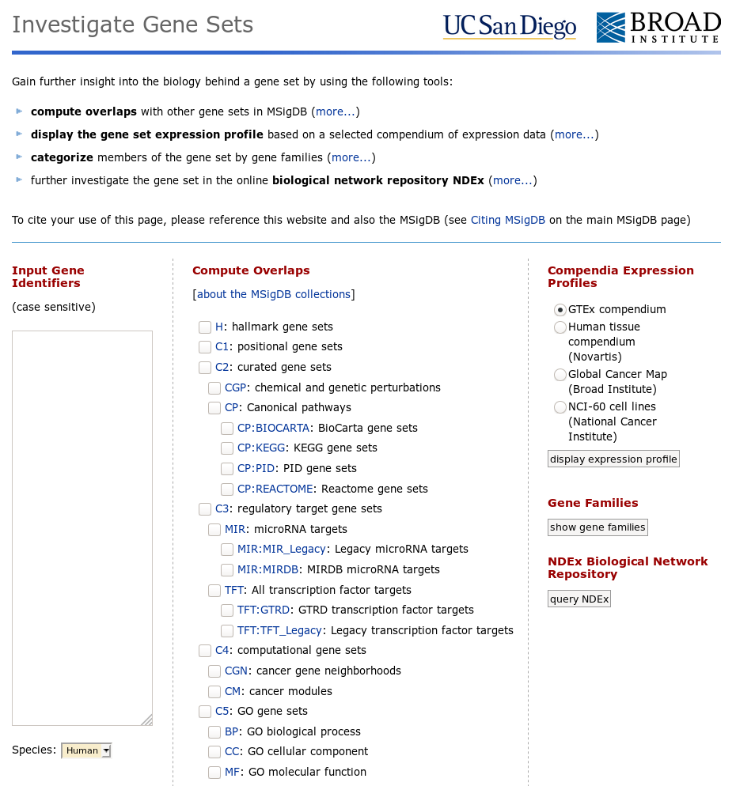

Now let us go back to Phantasus where we will be selecting top 250 
up-regulated genes.
For this we will us *Tools/Filter* menu.
There add a top filter by *t* column for 250 genes.

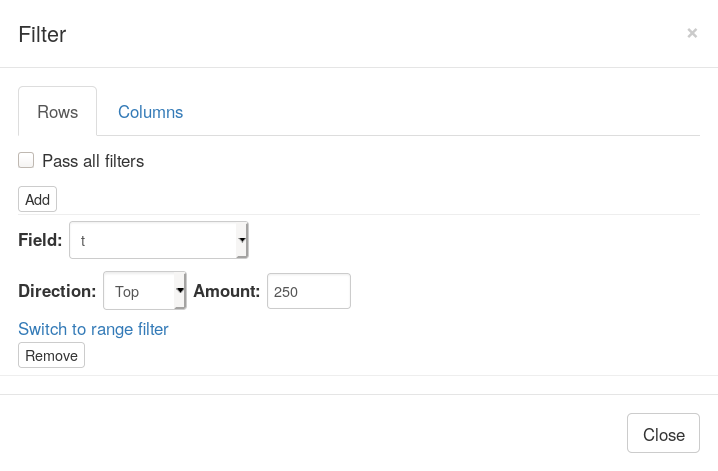

Next close the filter window and select all of the displayed genes. 
To copy gene symbol do a right-click on any value in *Gene symbol* column
and select *Copy selected values from Gene symbol* option.
After copying go back to *Tools/Filter* menu and remove the filter,
so that all 12000 genes are displayed again.

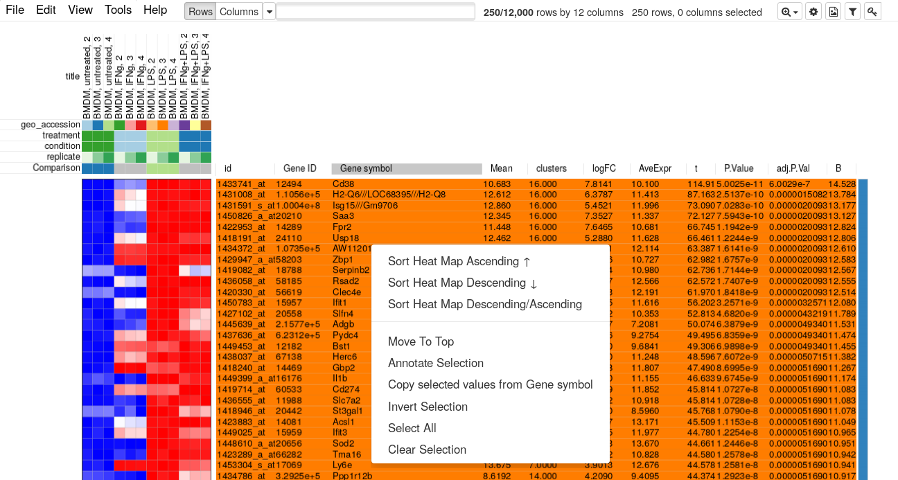

Paste the copied gene symbols to MSigDB, select proper species (mouse)
and select *H: hallmark gene sets* and *CP: Canonical pathways* collections.
Also, you can change parameters to show top 20 gene sets.
Click on *compute overlaps* to run the analysis.

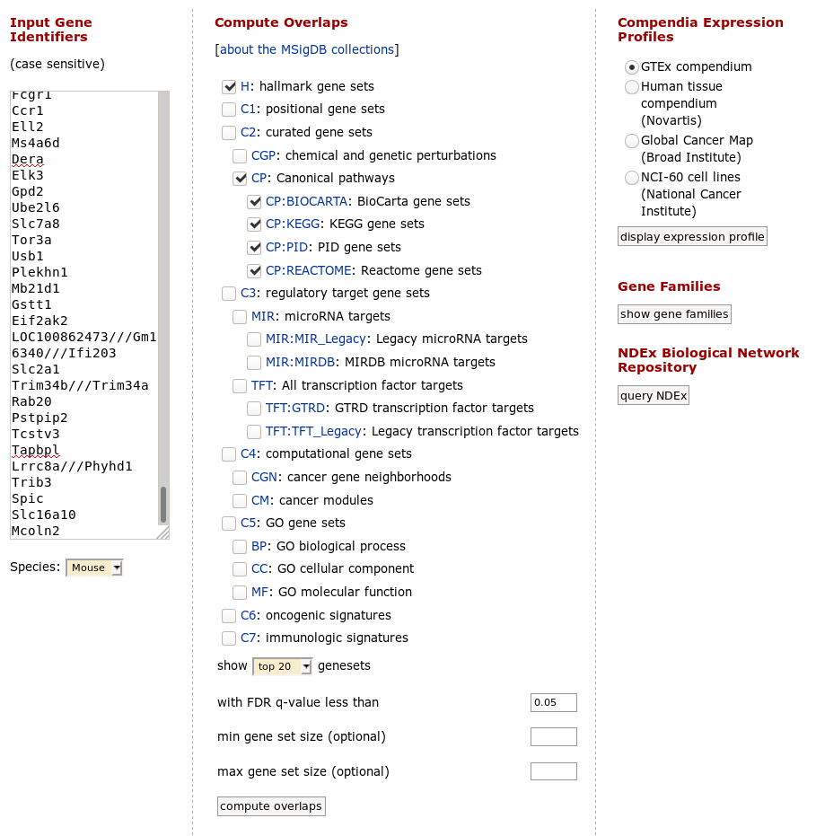

The screen features some statistics and the table with pathway p-values.
All the top pathways are immune singling pathways, in particular
interferon response, which is not unexpected.
However, in normal analysis, where the biology is not that well-known,
such analysis proves to be very useful.

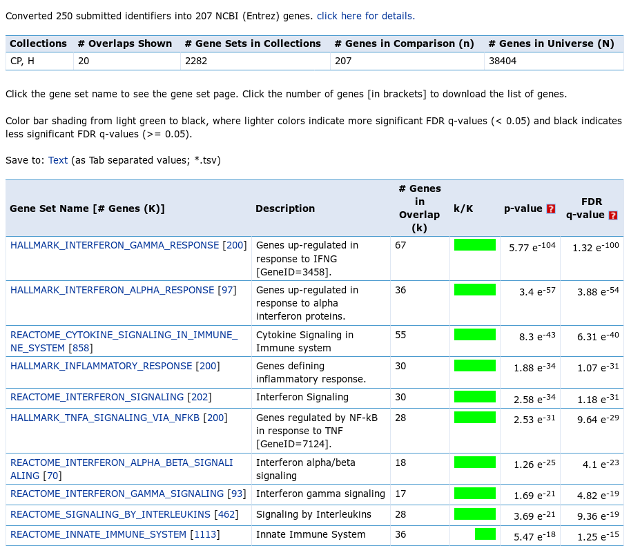

There is one important moment that should be considered, when MSigDB analysis is executed.
MSigDB web tool uses hypergeometric test as a statistical measure of overlap
significance. 
An essential parameter of the test is the background gene set (also called "universe"),
from which the query genes were selected.
In the reported statistics you can see that for the test a universe of 
38404 genes has been used, however the query was constructed by selecting
from only 12000 genes. 
This discrepancy leads to overreported results and the real p-values are
less significant than the reported ones. 
Pathways with very low reported q-value, such as 1e-12, won't become
non-significant after the correction, but pathways with q-value on the
order of 1e-3--1e-4 should be taken with caution.

## Visualizing pathway enrichment

A common way to visualize enrichment of individual pathways is to use
GSEA (gene set enrichment analysis) plot. In our case let consider Interferon Gamma Response pathway.

First, go to the pathway description: <http://www.gsea-msigdb.org/gsea/msigdb/cards/HALLMARK_INTERFERON_GAMMA_RESPONSE.html>.
There, click on *text* format in *Download gene set* row, which will get you a
file with a list of genes in this pathway: 
[geneset.txt]().

Copy the genes from the pathway and paste them in search field in Phantasus. 
Sort the dataset by *t* column and select *Fit To Windows* zoom option to 
get an overview of how the whole pathway is regulated.
You will be able to see that not just the top 250 up-regulated genes
contain many Interferon Gamma Response pathway genes, but overall
the genes from this pathway tend to be in the upper part.

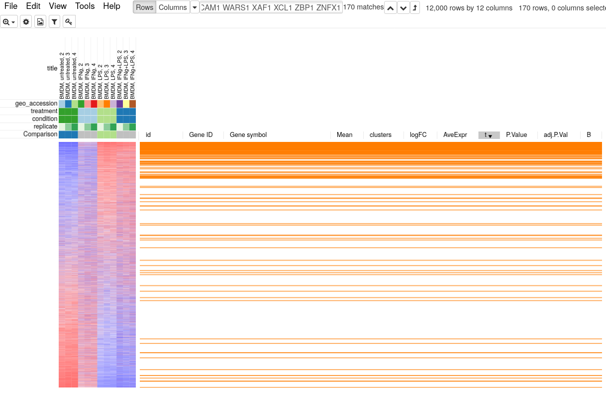

To quantify and better show the up-regulation trend GSEA analysis and GSEA
plot can be used. Go to *Tools/Plot/GSEA plot*. In the tool option select *t*
column for ranking and select *condition* for annotation.
This will result in the following plot.

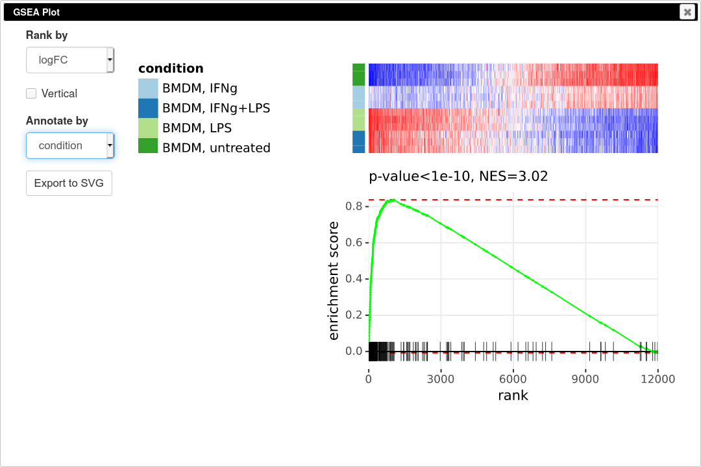

GSEA plot works as follows. First, the genes are ordered according to some metric,
such as t-statistic that we used. Next the genes are traversed one by one 
and if the gene is present in the considered pathway the curve goes up, and it
goes down otherwise. If the genes of the pathway tend to be up-regulated,
as in our case, the curve will first go up and then go down. If the 
pathway is down-regulated, the genes will be shifted towards the other end
and the curve will first go down and then up. If the pathway is not regulated
at all, then genes will be approximately uniformly distributed in the
ranking and the curve will also represent a random walk without any specific trend.
The displayed P-value shows quantitatively the non-randomness of the behavior.
An important aspect of GSEA analysis is that it does not require selecting 
any threshold, unlike hypergeometric based analysis described in the previous section.

## Pathway enrichment with FGSEA

GSEA analysis can be also carried systematically for a collection of pathways
with _FGSEA_ tool.

Open _Tools/Pathway Analysis/Perform FGSEA_, then select Pathway database, which corresponds specimen used in dataset
(Mus Musculus in this example), ranking column and column with ENTREZID or Gene IDs.

Clicking OK will open new tab with pathways table.

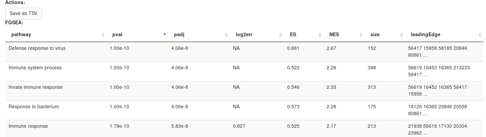

Clicking on table row will provide additional information on pathway: pathway name, genes in pathway, leading edge.
You can save result of analysis in `TSV` format.

## Other tools for pathway analysis

Aside mention above tools for pathway enrichment analysis there are few more
sometimes more suitable tools:
* [Enrichr](https://amp.pharm.mssm.edu/Enrichr) feature many diverse pathway
collections, especially interesting is transcription regulation collections. 
As Enrichr is strict to its input, *Tools/Pathway analysis/Submit to Enrichr* menu
can be used to simplify access.
* [WebGestalt](http://www.webgestalt.org/) can do pathway analysis for many organisms.
Additionally, the background gene set can be specified for over-representation analysis,
which make results much more accurate.
* [GeneQuery](https://artyomovlab.wustl.edu/genequery/searcher/) can be used 
to search for signatures among public datasets from Gene Expression Omnibus.
