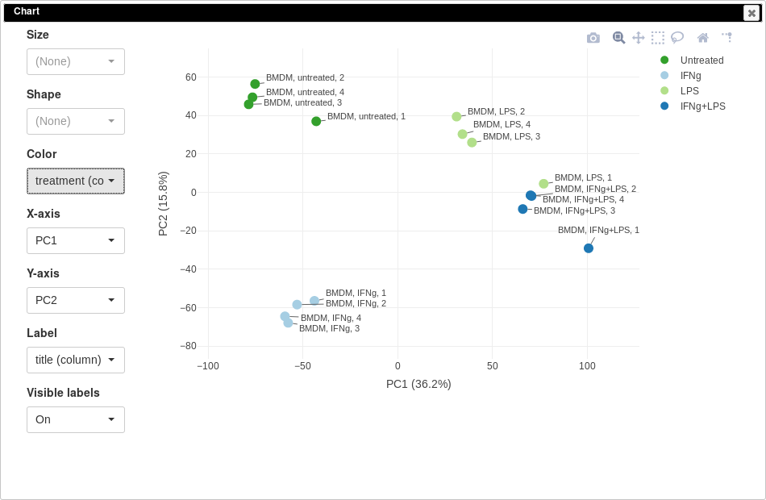
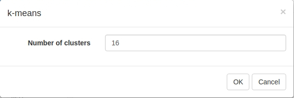
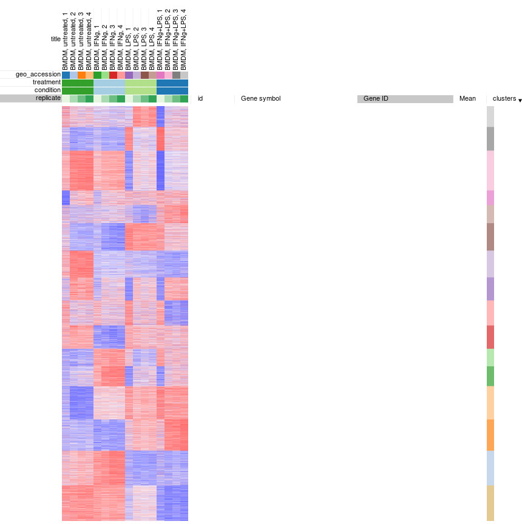
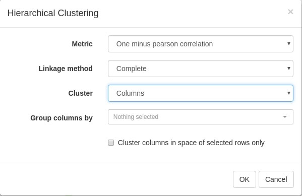
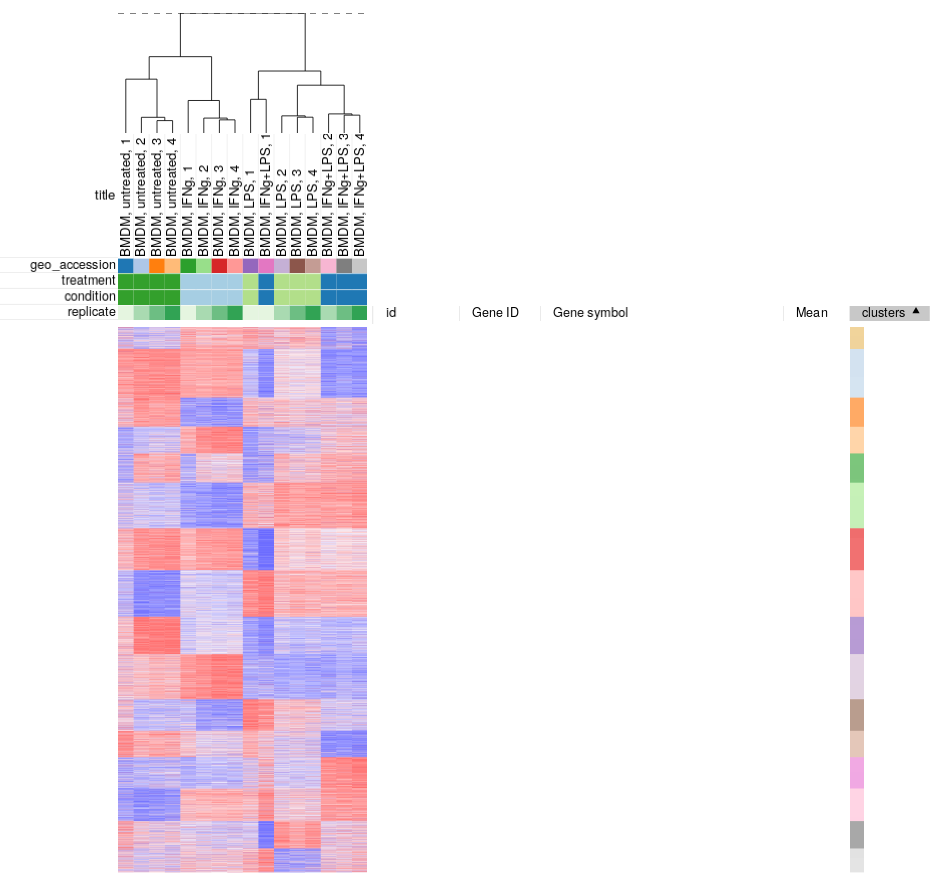
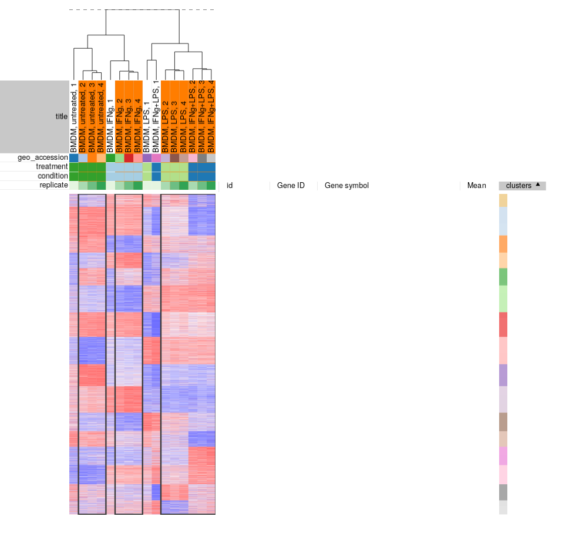

## Table of contents
{: .no_toc .text-delta }

1. TOC
{:toc }

## Introduction

This is the second of three related modules:
* [Preparing gene expression dataset]()
* [Exploring dataset]()
* [Differential expression and downstream analysis]()

In this module we start with normalized dataset, do a basic exploration and 
remove outliers, thus obtaining a proper dataset for differential expression analysis.

You can either continue the session from the previous module, or download
file [GSE53986_norm.gct]() 
and load it into Phantasus.

## PCA Plot

Principal Component Analysis (PCA) is an essential way to asses quality of the dataset.
One way to look at it is a as a linear dimension reduction method, that allows
to go from 10000-dimension space (by a number of genes) to something smaller,
like two or three dimensions, which can be displayed on a plane.
Importantly, PCA assumes Gaussian-distributed noise, so it should be
run on log-scaled gene expression values.

PCA plot can be done using _Tools/Plots/PCA Plot_ menu.
Each point on a PCA plot represents one sample.
You can customize color, size and labels of points on the chart 
using values from the annotation. For example one can set the color 
to come from _treatment_ annotation.

From this plot we can see that our samples more or less group together,
which is good, meaning that the samples from the same condition correlate 
well with each other and no so much with other conditions.
However, there are first replicates which seems to be outliers in three
of four conditions.

Notable property of PCA, as opposed to other dimension reduction techniques like
MDS or t-SNE, is that it is linear and thus principle components are 
interpretable.
In our case we can see that PC1 corresponds to LPS treatment (all LPS-treated
samples are on the right side, and non-LPS are on the left, note that
PCA can't distinguish positive from negative direction, so in your 
case the sides can be swapped) and PC2 corresponds to IFNg treatment.
Sometimes, sample labels can be accidentally mixed up and PCA analysis
can be used to catch this.

It is also can be useful too look at percent of variation explained by each component.
For example, in our case LPS treatment seems to have bigger effect compared
to IFNg treatment.

## K-means clustering

Another useful dataset exploration tool is k-means clustering.
It is a general clustering method, that can group genes into _k_
clusters based on their correlation (technically, Euclidean 
distance for z-score expression values is used). 

To apply k-means clusting use _Tools/Clustering/k-means_ menu.
There is no definite answer on the best value of _k_ to be used,
but the general heuristic is that the number of clusters scales
with the number of biological conditions in the dataset.
For the example dataset we will be clustering into 16 cluster:

Afterwards, rows can be sorted by _clusters_ column. By using 
menu _View/Fit to window_ one can get a "bird's-eye view" on the dataset,
which usually helps understanding the structure of the dataset.
In particular, it easy to see that the first replicates in each 
of the four conditions looks quite different from the other samples in the group.

## Hierarchical clustering

Similarly, clustering can applied to samples to better display 
inter- and intra- group correlations. Hierarchical clustering
is perfect for such analysis. Briefly it works by starting
from a set of cluster consisting of individual samples,
and on each step two closest clusters are joined, 
until a single cluster is left.

Let us use _Tool/Hierarchical clustering_ menu to apply hierarchical clustering.
There is a number of parameters, but they can be left as is.

A dendrogram showing how clusters were joins is added on top of the heatmap.
We can again see that the first replicates are clustering outside of their groups.

## Filtering outliers

From our exploration we can conclude that while overall the dataset
looks good and samples in the groups correlate well with each other,
there are outliers which can be removed.
You can select the good samples 
and extract them into another heatmap (by clicking _Tools/New Heat Map_ or pressing _Ctrl+X_).

Finally, let us save the filtered dataset as "GSE53986_filtered.gct" using 
_File/Save Dataset_ menu. For the reference, the result should be similar
to the following file: 
[GSE53986_filtered.gct]().

There is a couple of points that should be kept in mind about filtering outliers:
* There is no definite way to distinguish outliers from biological variation,
so one has to be cautious about them for the process not to turn 
into cherry-picking. For this particular dataset we can see that, for example,
*untreated 1* sample is quite different from pretty tight group of other untreated samples.
Moreover, the fact that all outliers are the first replicates indicate that there
was a systematic batch problem, probably related to plate layout during sample
preparation step.
* Sometimes outliers can be very different from other samples. In this case
the analysis has to be redone from scratch after removing the sample. 
Otherwise, during quantile normalization step the bad samples were taken into
account as well, thus making data in the good samples more noisy.

## Summary

To summarize this and the previous module:
1. For the most types of analysis gene expression data should be log-scaled. 
Sometimes the data can be already log-scaled, some time it is not.
It is important to check this and make it log-scale if necessary.
2. Gene expression data should be normalized, so that the samples can be properly
compared. One of the most straightforward way to do it is quantile normalization.
3. The data has to be quality checked. For this you can look at marker genes,
do a PCA analysis and clustering.
