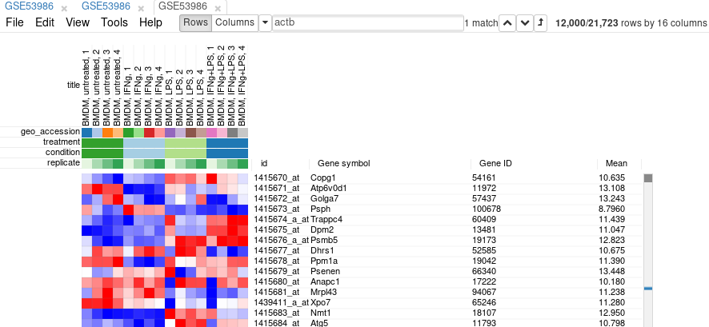

## Table of contents
{: .no_toc .text-delta }

1. TOC
{:toc }

## Introduction

This is the first of three modules on analysis of microarray dataset GSE53986:
1. [Preparing gene expression dataset]()
2. [Exploring dataset]()
3. [Differential expression and downstream analysis]()

In this module we cover steps from finding a gene expression dataset link
in a published paper to a normalized dataset, prepared
for exploration and further analysis.

## Obtaining Gene Expression Omnibus entry 

Let's start from a most common unit of scientific knowledge: a publication.
Imagine, you found a nice paper which mentions gene expression analysis by 
microarray, for example [this one](http://www.nature.com/nature/journal/v509/n7499/full/nature13152.html).
Thankfully most journals nowadays require the gene expression data deposited
publicly, which means that we can look more closely at the data, beyond 
what is described in the original publication.

The dataset link usually resides either in dedicated data availability 
statement, or in methods section as in this case. We are looking 
for something like "accession number" followed by an identifier. Here 
we have "GSE53986". There can be different kinds of identifiers,
but in this tutorial we focus on the GSEnnnnn ones.

The easiest way to go to the corresponding database entry is 
just use Google. 
The first link would be 
<https://www.ncbi.nlm.nih.gov/geo/query/acc.cgi?acc=GSE53986>,
which is exactly what we need.

The entry contains basic information like title of the dataset, 
abstract, link to the publication and so on. From the samples
list we can easily see that the dataset contains four biological
conditions: control bone-marrow derived macrophages (BMDMs)
and BMDMs activated with either LPS, interferon-gamma or both of them
simultaneously.

## Basic controls

Now let us open the dataset in Phantasus. Use <https://alserglab.wustl.edu/phantasus>
mirror. Then click on *Choose a file* input, select *GEO Datasets*,
enter GSE53986 and click *Load* button (or press *Enter* on the keyboard).

After the dataset is loaded you will see the heatmap interface.
The heatmap columns correspond to the 16 biological samples in this experiment.
The rows correspond genes (or, more accurately, to microarray probes).
If you hover the mouse cursor over a cell a pop-up will appear displaying
the expression value of the corresponding gene in the corresponding sample.
By default a row-relative scheme is used: blue color corresponds to the lowest 
expression in a row and red color corresponds to the highest one.

Besides expression values the annotation for genes (*Gene ID*, *Gene symbol*)
and samples (*treatment*, *condition*) are displayed.
The annotations are loaded from user-submitted GEO annotations 
(they can be seen, for example, in _Charateristics_
section at <https://www.ncbi.nlm.nih.gov/geo/query/acc.cgi?acc=GSM1304836>).
We note that not for all of the datasets in GEO such proper annotations are supplied.
Additionally *condition* and *replicate* annotations are generated automatically
based on sample names.

When opening a new dataset it's usually helpful to check marker genes to 
confirm that the dataset is what you expect it to be. Here let's check
known marker of macrophage activation: Acod1. Put the gene name into the
search field and click down arrow to scroll to the hit. We can see, that
the gene is highly up-regulated in LPS and LPS+IFNg conditions.

If you look at the expression values more closely you will be able to 
see that there is some up-regulation of Acod1 in IFNg. That can be 
more easily seen if we plot the expression using *Tools/Plots/Charts*.
Select all the columns to show the values in all the samples.

<!-- :TODO: add arrows for selecting all columns and selectin condition label -->

## Data normalization

Importantly the gene expression values are better to consider in logarithmic
scale in most cases. There are two related reasons for this. First,
the fold-changes are more interpretable: if we see an mRNA two-fold 
change it's probably important, independent of the actual base-level concentrations.
Second, many statistical models assume that the noise is normally-distributed,
which is much more the case in log-scaled expression than in the linear scale.

Sometimes the gene expression data can be already log-scaled, some time it is not.
The simplest way to check it is to look at the expression values. If they
are small (say, in the range 0--20), then the data is already scaled, if 
there are big number (say, greater then 100), then the data is in linear scale.

The more accurate way to check scale is to get a box-plot of all the expression
values in in the sample.
Select all the genes and all the samples.
Open *Tools/Plots/Charts* dialog, select *boxplot* in *Chart type*.
Select *title (column)* in *Group by* to show the boxplots by sample.
From the plot you can clearly see that there is a wide range of expression 
values.

To apply log-scale normalization go to _Tools/Adjust_ menu, check _Log 2_ 
and click *OK*.
A new tab with log scaled values will appear:
all operations that modify gene expression
matrix create a new tab, which allows 
to revert the operation by going back to one of the previous tabs.
If we do a boxplot again, we will see that the range 
of the expression values is much smaller now, and it is more symmetrical.

On the same plot you can see some variation of expression distribution between
the samples. 
For example, the second sample seems to have overall higher
expression values compared to the first one.
This can happen for multiple reasons, in particular there can 
be just more input mRNA.

To be able to better compare different samples we will normalize
distributions using so-called quantile normalization.
This can be done using *Tools/Adjust* menu and checking
*Quantile normalize* option. After that, again, a new tab
will appear with normalized values.
If we plot the distribution using boxplots, we will see
that the distributions are now identical.

Few remarks about the normalization:
* Log-scale and quantile normalization can be done in one step by checking
both checkboxes simultaneously.
* Check that you haven't done log-scale twice: if the range of values becomes
around 0--4 that's probably what happened.
* Quantile normalization can usually won't make anything worse, so if you are
not sure whether some inter-sample normalization was applied, it is usually 
safe to apply quantile normalization just in case.

## From probes to genes

If you have looked some other genes in the table you could have noticed
that some of the genes are present in the table multiple times.
Indeed, in microarrays oligonucleotide abundance, not gene one, is measured
and multiple oligonucleotides can match to a single gene,
as well as one oligonucleotide sequence can be present in multiple genes.

For example, let's put Actb gene in the search field and click "Matches to top"
button. We can see that there are five microarray probes mapped 
to Actb gene. 

It is usually much more convenient in terms of analysis and 
interpretation to work with gene-level, not probe-level, expression values.
This requires a collapse procedure to go from multiple gene entries to a single 
entry.

There are multiple ways of collapsing. Probably, the most naive way 
is just to average expression of a gene among all the corresponding probes. 
However, there can be very noisy probes, which we would rather throw out, and 
not spoil the other values.

The other way which we usually recommend is to select the probe with the 
highest average expression level. This has two advantages: 

* usually the noisy probes are the ones with low expression (exercise:
plot probe profiles for Actb and check that the lowest probe 
indeed has the most variance), and
* we can trace gene expression to a particular measurement 
which can help if there are problems downstream.

To collapse probe to genes we will use *Tools/Collapse* menu.
We mentioned before we will be keeping only the highest expressed
probe for a gene. In this case it will be measured by median expression
(in log-scale, the mean expression can be used as well),
so select *Maximum Median Probe* as a collapse method.
Selecting *Gene ID* in *Collapse to fields* will group the probes
based on *Gene ID* field and will ensure that after collapse there
are no duplicate entries in *Gene ID* column.

The resulting table will contain only 21722 rows (which is equal
to approximate 20K protein-coding mouse genes) with only one entry
for Actb gene, coming from probe "AFFX-b-ActinMur/M12481_3_at":

Finally, it is useful to get rid of unexpressed or lowly expressed 
genes to decrease noise amount in our data.
It is particularly important
for microarrays, where even for absent genes there will be non-zero
values due to cross-fluorescence.

An easy way to do it in Phantasus is to filter genes based on average expression.
First for each gene we obtain average values using *Tools/Create Calculated Annotation*
menu:

After clicking *OK* a new column with average values should appear:

To filter the genes we will be using *Tools/Filter* menu.
Click _Add_ to add a new filter. Choose *Mean*
as a _Field_ for filtering. Then press _Switch to top filter_ button
and input the number of genes to keep. A good choice for a typical mammalian dataset
is to keep around 10--12 thousand most expressed genes. Another option to filter
is to use a strict threshold with a range filter, but this requires
selection of an appropriate threshold which depends on a dataset, so a top
filter is much more convenient.

Filter is applied automatically,
so after closing the dialog with _Close_ button only the genes passing the filter 
will be displayed.

It is more convenient to extract these genes into a new tab. 
For this, select all genes (click on any gene and press _Ctrl+A_) and 
use _Tools/New Heat Map_ menu (or press _Ctrl+X_).

## Saving and loading datasets in gct

The resulting dataset can be saved locally, so that it can be easily reloaded.
In order to save it use _File/Save Dataset_ menu. 
Enter an appropriate file name (e.g. `GSE53986_norm`)
and press `OK`. 

After that a file in a text [GCT format](https://software.broadinstitute.org/cancer/software/gsea/wiki/index.php/Data_formats#GCT:_Gene_Cluster_Text_file_format_.28.2A.gct.29)
will be downloaded. 
The file should be similar to
[GSE53986_norm.gct](). 
As GCT is a text format, you can open and modify it in a text or spreadsheet editor.

To load dataset use *File/Open* menu, click on *Open your own file* dropdown menu,
click on *My computer* and select there the gct file.
The file will be opened in a new tab.
Similarly, a file can be opened from the home screen.

